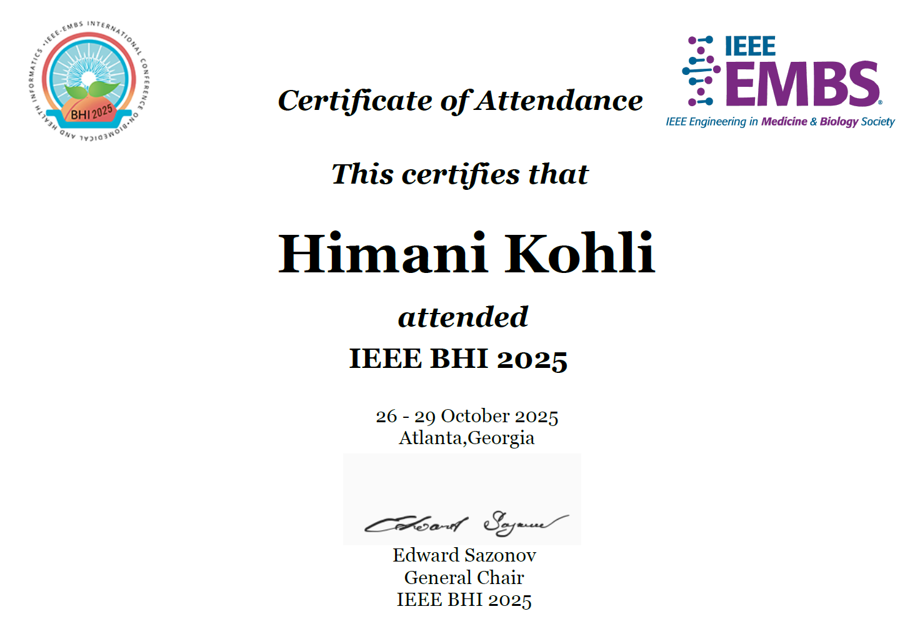
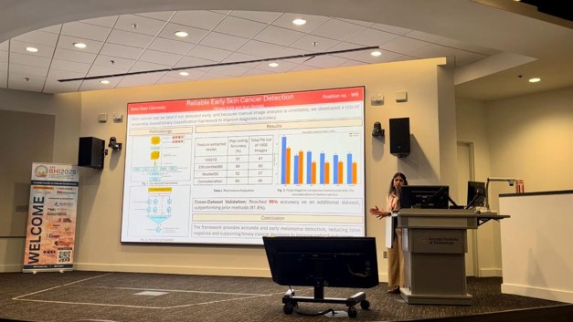
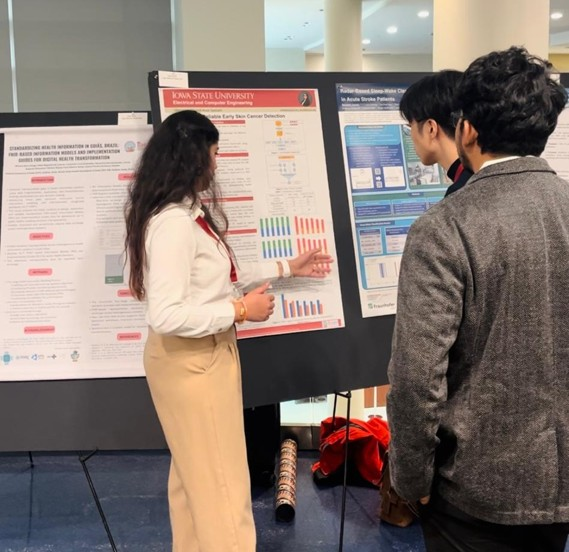

# IEEE BHI 2025 – Atlanta, Georgia

Participated in the **IEEE International Conference on Biomedical and Health Informatics (BHI) 2025** in Atlanta, Georgia.

I was selected as an **NSF-EMBS-Google Sponsored Young Professional NextGen Scholar** and presented my research poster during the conference.
## Presentation
Presented a **one-page research abstract** at the conference and discussed my work with researchers in biomedical AI and health informatics.
## Highlights
- NSF-EMBS-Google Sponsored Young Professional NextGen Scholar Recognition
- Research poster presentation
- Networking with researchers in biomedical AI, medical imaging, and health informatics
## Certificate

## Conference Highlights

